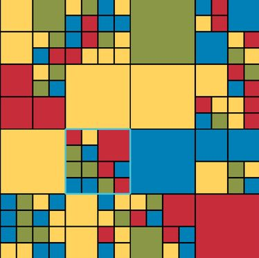

# **Haskell-6**

## **BLOCKY:**

### **Description:**
A visual game in which players apply operations such as rotations to a recursive structure in order to work towards a goal. The main data structure we used are lists. We can also use some interesting and challenging algorithms. 
Game assignments may be less appealing to female students than male students, so we designed a game puzzle like, with simple rules, but that is challenging to play. We think that the game board is attractive.

### **The Game:**
Blocky is played on a randomly generated game board made of sqaures of different colours. We call the game board a block. A **block** is either:
* A sqaure of one colour
* Or a sqaure subdivided into 4 equal sized blocks

 

Each player is randomly assigned their own goal to work towards such as to put as much of a given colour on the outer perimeter as possible.

 

There are two kinds of player moves:
* Rotating a block(either clockwise or counter-clockwie)
* Swapping the two halves of a block(horizontally or vertically)

 

What makes more interesting is that they can be applied to any block at any level. For example on the board on left below, the user has choosen a block(highlighted) that is two levels below the top level. Rotating it clockwise would result in the board that is on the right.

 

 

### **Strengths:**

The game is visually appealing, players enjoy thwarting opponents efforts to reach while achieving your own goal.

### **Weakness:**

When applying an operation to the board, the code updates the rendering but does not animate the change. It can be difficult to see what happened.

### **Variants:**

Developers can invent and/or implement new types of moves. Possibilities include:

Splitting each undivided block into four undivided sub-blocks of random colours.
Merging each block that has four undivided sub-blocks into a single block of the majority colour. (Ties can be broken randomly.)
Randomly changing all the colours while maintaining the same structure.

Developers can invent and/or implement new types of goal. Possibilities include:

Placing as much of one colour as possible on a diagonal.
Distributing one colour as much as possible. (Even defining the measure for this goal is interesting.)

An undo operation could be added. If multiple undos are allowed, which would make sense in a solo game, this opens up a discussion about whether to store previous board states or previous operations, and the associated time-space tradeoffs.

